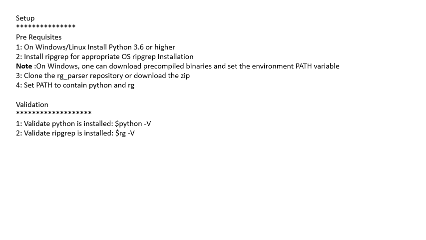

# User Guide  
The guide is to provide an introduction to the user about rg_parser python script, used to generate analysis.bat/sh script based on configuration provided by user.  

> Dependencies  
>> rg_parser uses [ripgrep](https://github.com/BurntSushi/ripgrep/blob/master/GUIDE.md "The fastest search") underneath to make search in directory
---  

### Table Of Contents
 * [Use-Case](#use-case)
 * [Setup](#setup)
    * [Pre-Requisites](#pre-requisites)
    * [Validation](#validation)
    * [Usage](#usage)
* [Search Patterns](#search-patterns)
* [Self Documented INI](#self-documented-ini)
 * [Troubleshooting](#troubleshooting)
    * [Windows](#windows)
 * [Report an Issue](#report-an-issue)

## Use-Case
- Allows documentation of logs pattern in configuration, making search consistent and reusable
- Allows documentation of logs pattern for cases. You can keep versioning *.ini file as you progress
- Helps in knowledge transfer among workers. The *.ini file generate can be used by other workers with same setup

---  
## Setup
 ### Pre Requisites
 1. On Windows/Linux Install Python 3.6 or higher
 2. Install ripgrep for appropriate OS [ripgrep Installation](https://github.com/BurntSushi/ripgrep#installation)
  - **Note** :On Windows, one can download [precompiled binaries](https://github.com/BurntSushi/ripgrep/releases/tag/13.0.0) and set the environment PATH variable 
 3. Clone the [rg_parser repository](https://github.com/sjainproductivity/rg_parser.git) or download the zip
 4. Set PATH to contain python and rg
  
 ### Validation
 1. Validate python is installed: 
    $python -V
 2. Validate ripgrep is installed:
    $rg -V
      
---  
## Usage
1. Generate the *.INI file if not there
2. Use the *.INI file to generate the analysis.(bat|sh) file
3. Run the analysis.(bat|sh) file on directory to search and output_dir


```
usage: CARA Logs Analysis [-h] [--config CONFIG] [--analysis ANALYSIS]

optional arguments:
  -h, --help            show this help message and exit
  --config CONFIG, -c CONFIG
                        Generates a configuration file. Ex -c config.ini
  --analysis ANALYSIS, -a ANALYSIS
                        Generates an analysis.(sh|bat) script file from configuration file. Ex -a config.ini
```
- Example: Generating config file template
1. Generate *.ini file
      
```
$python -c/--config CONFIG_FILE_NAME.ini
  OUTPUT
  [default]
    only_files = False
    match_count = False
    text_search = True
    ignore_case = True
    word_match = True

    [search_filter]
    all = *.*
    error = *.*
    warn = *.*

    [error]
    error = ERROR

    [warn]
    warn = WARN
```
 2. Generate analysis.(bat|sh) based on INI file
```
    $python -a/--analysis CONFIG_FILE_NAME.ini
```
3. Run analysis.(bat|sh) file on directory
```
    $analysis.sh SEARCH_FOLDER OUTPUT_DIR
```
---  


---  
## Search Pattern
The INI file contains script sections and user defined sections. The script will generate section_parser.log file for each section defined in INI file except for default and search_filter.

 ### Search Filter patterns
 [search_filter] section is used to narrow the search to specific file for specific sections
 1. __"error=\*.\*"__ : It will look for patterns defined in error section in all files
 2. __"error={error.log,error.log\.[1,3]}"__ : It will look for patterns in error section in files error.log, error.log.1 and error.log.3
 3. __"error={error.log,error.log\.[1-3]}"__ : It will look for patterns in error section in files error.log, error.log.1, error.log.2 and error.log.3

 ### Section Search patterns
 It is userdefined sections used to search for specific patterns in files. Please use reg-ex to filter your search.
 1. ERROR = "^2021-08-24.\*ERROR.\*" : This pattern will search for ERROR|error (ignore case = True) on date 2021-08-24
 2. "node stopped"=".*gsi_server_run.\*\| GSI server stopping.\*" : This pattern will search for the mentioned specific pattern
 _Note_: In case you want a single file with all patterns you can create a section all and put in all patterns beneath it. For example refer below
  ```
  [all]
  ; To check when the NAC service is restarted
  "Service Restarted" = "Root WebApplicationContext"
  ERROR=ERROR
  "ORA ERROR"="ORA-30036"
  ```  
---  
## Self Documented INI
To make the INI files self documented, which can be used for sharing knowledge among workers you can follow a practice of mentioning KB's links you came across within INI file (using comment syntax of INI i.e. ';') for specific error patterns. The user referring your INI file can refer those KB directly. For example refer below
```
[ALL]
; https://knowledge.broadcom.com/external/article?articleId=223266
"node stopped"=".*2021-08-15.*gsi_server_run.*\| GSI server stopping.*"
```
---  
## Troubleshooting

 ### Windows
 - 'rg' is not recognized as an internal or external command : The rg.exe is not configured in PATH.
---  
## Report an Issue
- [rg_parser_issues](https://github.com/sjainproductivity/rg_parser/issues)